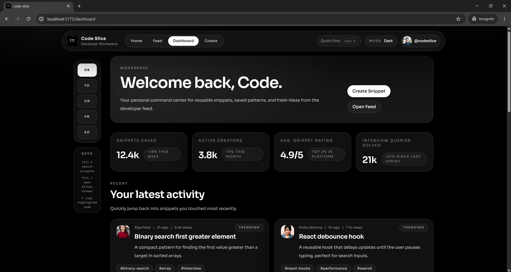
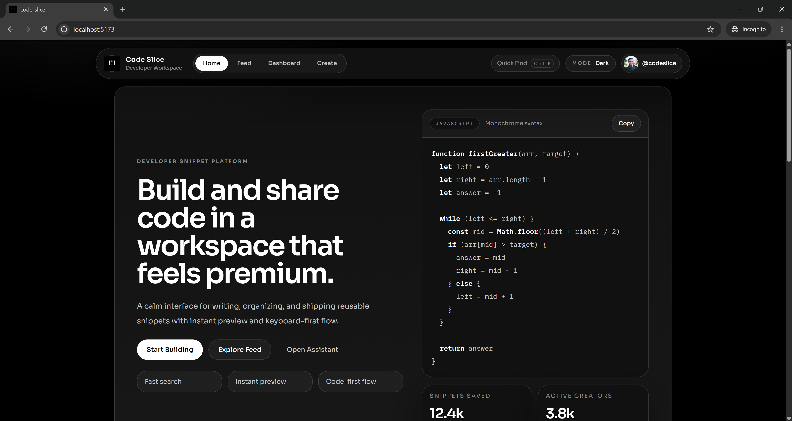
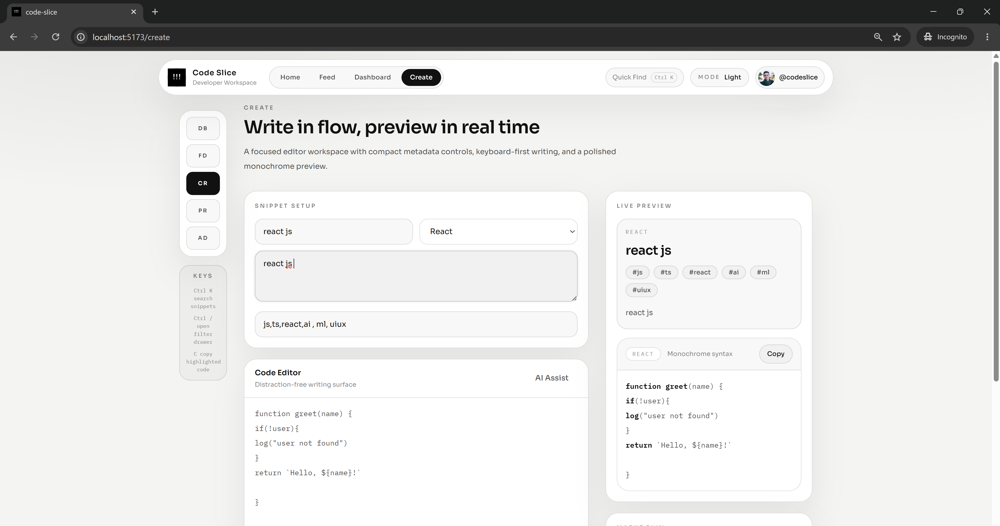
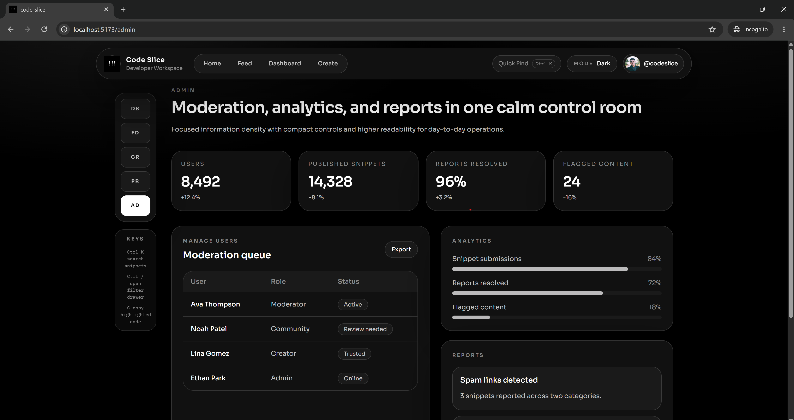
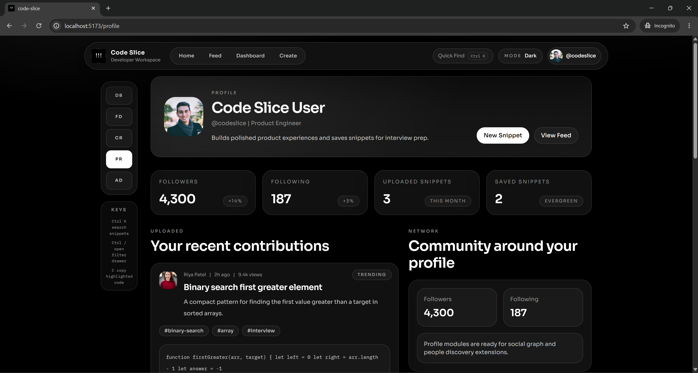

# Code Slice Frontend

Modern developer-focused code snippet sharing platform built with React, TypeScript, and Tailwind CSS.

## Features

- Share reusable code snippets
- Syntax highlighting
- Minimal black & white UI
- Responsive design
- Live snippet preview
- Search & filter snippets
- Bookmark snippets
- Developer dashboard

## Tech Stack

- React
- TypeScript
- Tailwind CSS
- React Router
- Axios
- Framer Motion

## Installation

```bash
git clone https://github.com/zaid2904/Code-Slice---client.git

cd folder-name

npm install

npm run dev
```

## Folder Structure

```bash
src/
 ├── components/
 ├── pages/
 ├── layouts/
 ├── hooks/
 ├── services/
 ├── types/
 ├── utils/
 └── assets/
```

## Future Improvements

- AI snippet assistant
- Real-time collaboration
- Collections & playlists
- Dark/light themes
- Code execution support

## Author

Zaid Siddiqui

## Screenshots

- **Dashboard**



- **Home**



- **Create Snippet**



- **Admin Panel**



- **Profile**


